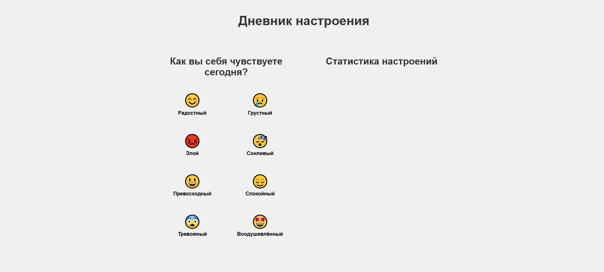
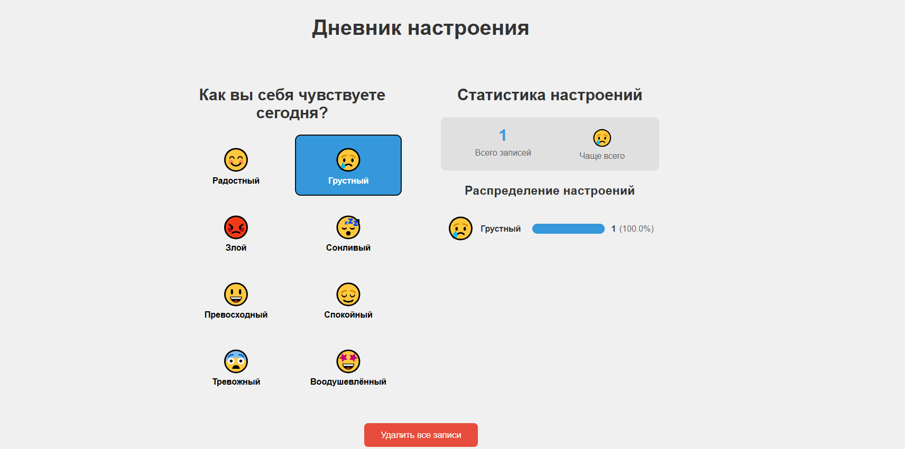
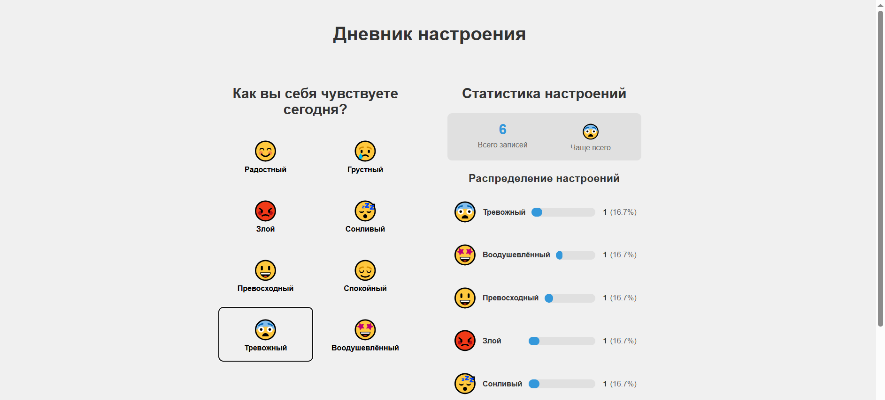
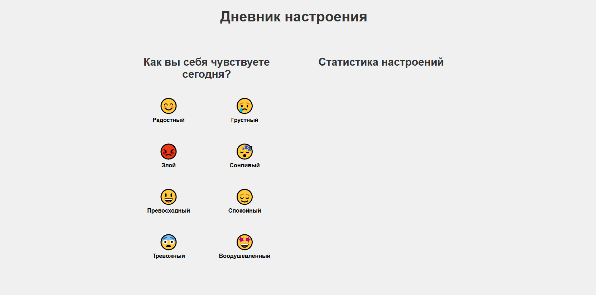

<h1 align="center">Показ работы приложения</h1>

Главная страница приложения

После добавления одного смайлика

Теперь добавим несколько

Кнопка удаления

После нажатия на кнопку удаления

Запуск командой 
npm install
npm start